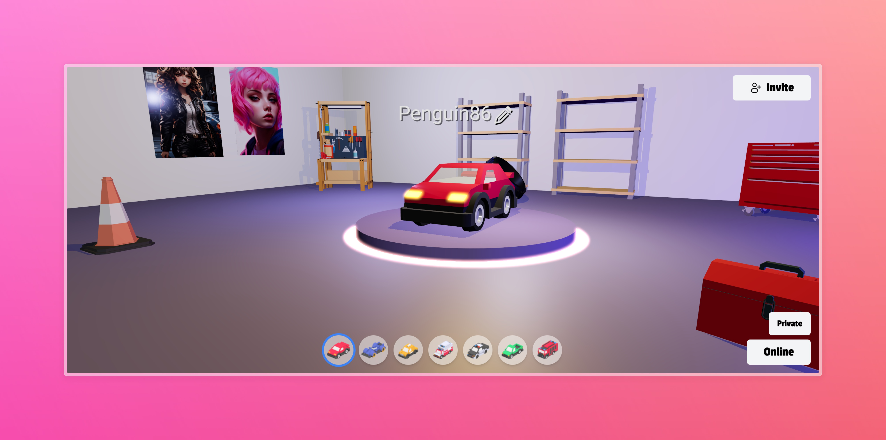
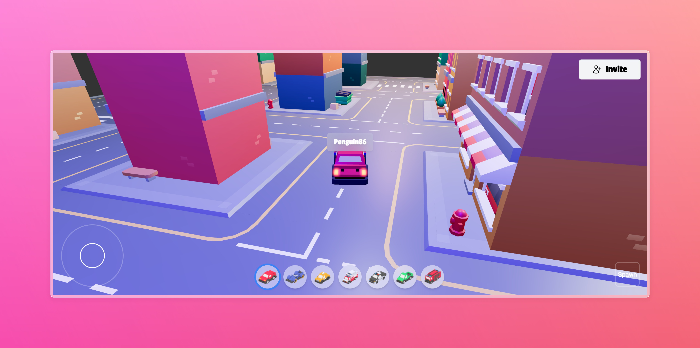

# 3D Multiplayer Car Lobby



A multiplayer driving experience built with React Three Fiber and Playroom, allowing players to drive cars in a 3D environment and interact with each other in real-time.



## 🎮 Features

- Real-time multiplayer car driving
- 3D environment with city elements
- Physics-based vehicle controls
- Interactive objects and props
- Seamless multiplayer synchronization using Playroom
- Modern 3D graphics powered by Three.js and React Three Fiber

## 🛠️ Technologies


- [React Three Fiber](https://docs.pmnd.rs/react-three-fiber) - React renderer for Three.js
- [Playroom](https://docs.joinplayroom.com/) - Multiplayer game framework

## 📋 Prerequisites

- Node.js (v16 or higher)
- npm or yarn
- Modern web browser with WebGL support

## 🚀 Getting Started

1. Clone the repository:
```bash
git clone https://github.com/pakagronglb/3d-car-lobby-playroom.git
cd 3d-car-lobby-playroom
```

2. Install dependencies:
```bash
npm install
# or
yarn install
```

3. Create a `.env` file and add your Playroom API key:
```
VITE_PLAYROOM_API_KEY=your_api_key_here
```

4. Start the development server:
```bash
npm run dev
# or
yarn dev
```

5. Open your browser and navigate to `http://localhost:5173`

## 🎨 Assets and Credits

### 3D Models
- Car models from [Kenney Car Kit](https://www.kenney.nl/assets/car-kit)
- City elements from [Kay Lousberg City Builder Bits](https://kaylousberg.itch.io/city-builder-bits)

### Props and Objects
- [Toolbox](https://poly.pizza/m/bNqhcgTSc_E)
- [Toolbox2](https://poly.pizza/m/20JcnkCnbAc)
- [Workbench](https://poly.pizza/m/24I9X8aeWTR)
- [Cone](https://poly.pizza/m/WoXpAJT0oDn)
- [Tires](https://poly.pizza/m/mmq7GmG1AK)
- [Shelf](https://poly.pizza/m/6gKdASmfB9U)

### Audio
- Sound effects from [Soundeffect-lab](https://soundeffect-lab.info/sound/machine/)

### AI-Generated Assets
- Images generated using [Leonardo.ai](https://app.leonardo.ai/)

## 👨‍🏫 Tutorial Credits
This project is based on the tutorial by [Wawa Sensei](https://www.youtube.com/watch?v=1-7PY08aRM0&list=PLpepLKamtPjjJ4ig8QfpvaOOd3RlYFUc-&index=2&t=831s)

## 🤝 Contributing

Contributions are welcome! Please feel free to submit a Pull Request.

1. Fork the project
2. Create your feature branch (`git checkout -b feature/AmazingFeature`)
3. Commit your changes (`git commit -m 'Add some AmazingFeature'`)
4. Push to the branch (`git push origin feature/AmazingFeature`)
5. Open a Pull Request

## 📝 License

This project is licensed under the MIT License - see the [LICENSE](LICENSE) file for details.

## 🙏 Acknowledgments

- [Wawa Sensei](https://www.youtube.com/@WawaSensei) for the excellent tutorial
- [Kenney](https://www.kenney.nl/) for the car assets
- [Kay Lousberg](https://kaylousberg.itch.io/) for the city assets
- The React Three Fiber community
- The Playroom team for their multiplayer framework

